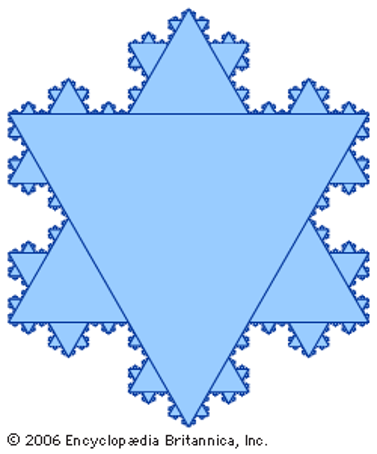
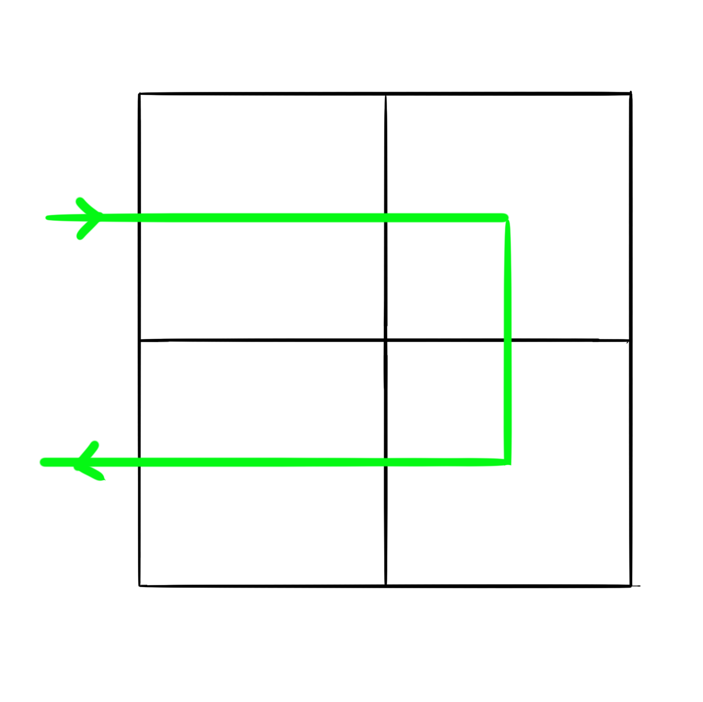
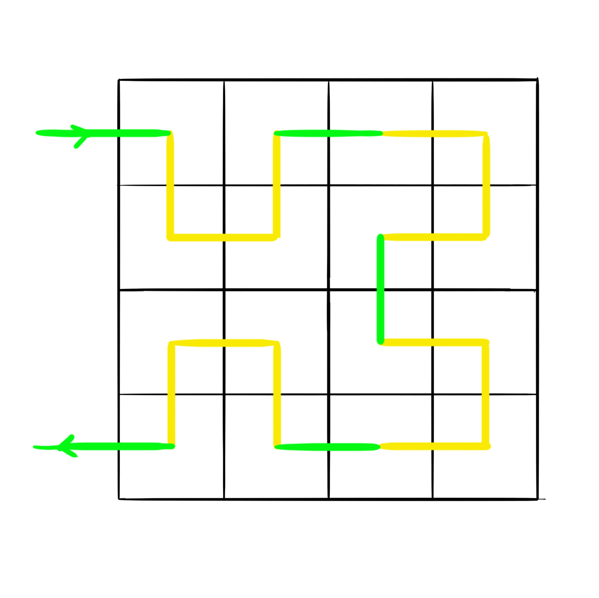
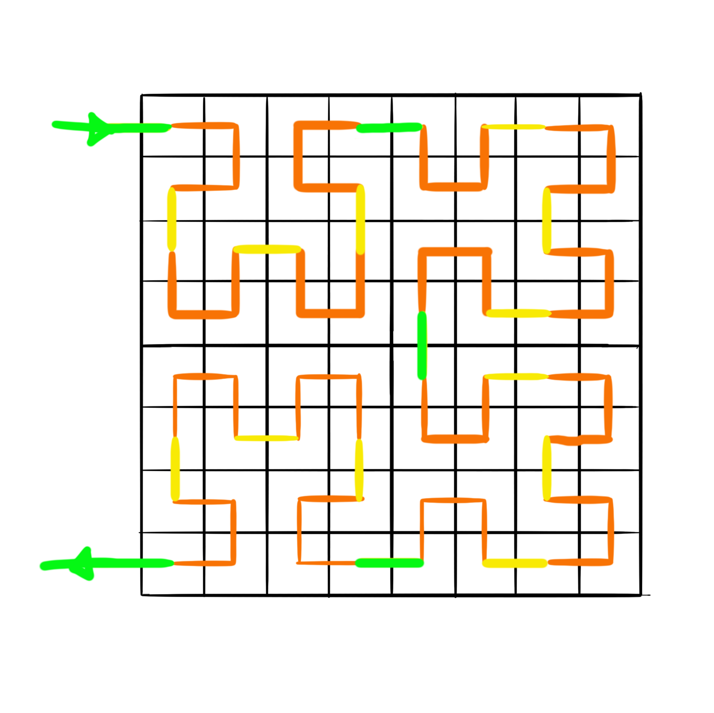
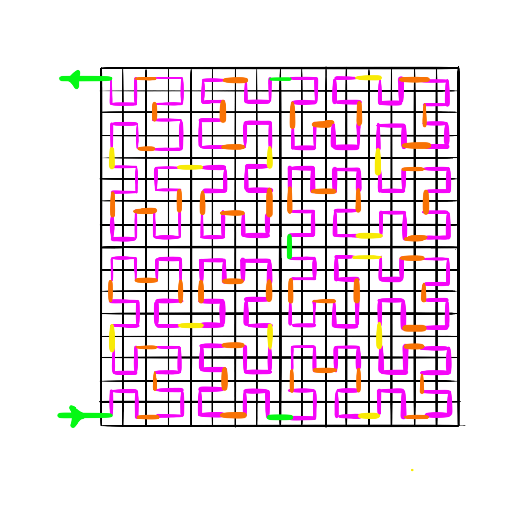
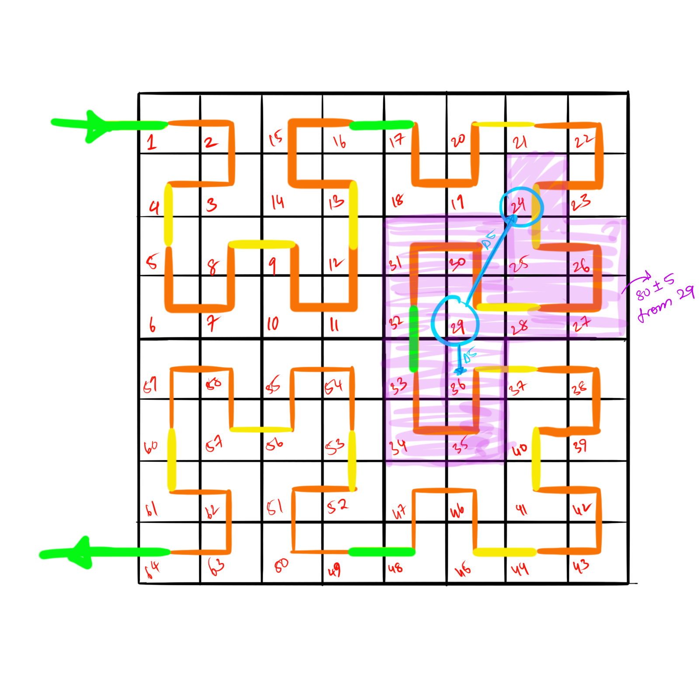

This article is loosely based on the previous one.

So we have the following problem: 
	We have to find the most efficient method to find the n closest points to a point.

We can do that quite easily by just finding the distance between that point and every other point and sorting that list. It’s quite easy to see that that just isn’t very efficient.

But what if we can project the collection of points on a line, then it’d be very easy to get the n closest points, and it’d also be easy to do range queries on a 1-d array.

So the question is to be asked, how exactly do you map a 2-D space to a 1-D array?
How?

Well what if you ran a squiggly line through the 2-d space that runs through all points, you would be bound get a 1-D array of points that has an order. The question now becomes what would the line look like?

Now, this line, has to be ‘scalable’ it has to run through every point, but have a discernable pattern that’s really optimal.

What we need in essence, is a self replicating kind of shape, like in essense we should have a path in a shape that is optimal, but could be called to be infinitely large.

We can use the idea of fractals here, basicly, like verrry basicly, a shape of finite area, but infinite area, an example of a fractal is a Koch snowflake, made by replacing the middle third of each side of an equilateral triangle with 2 line segments that resemble a equilatoral triangle shaped hump, you do this infinitey and you’ll get a shape like this.

 

Soooo what shape would you use to trace a path through a 2-D space? 
The 2-D space we consider will be the most basic, a 2x2 grid.

The shape is shown here is green. This shape is not entirely trivial, it is more accurate than a Z shape or an alpha shape.
The shape is called a Hilbert curve.

   
Now we divide each of the 4 subsections to 4 more sections , and those into 4 more, and so on and so forth

  
 
Each time we use the ‘C’ shape recursively? Is that the word? Sure, lets go with it.
Every time, the ‘C’ is made into 4 different smaller Cs with their relative linking being in the shape of the original C.

Now that we have mapped this 2-D space onto a 1-D line, its waaayyy easier to perform range queries, and to determine information like n closest points to a point, but this system isn’t perfect.

Like in any aspect of life (wow much philosopher) there are obvious tradeoffs with this method…
So lets reiterate the pros:
1.	Makes range queries really easy.
2.	Make it easy and fast to obtain the ‘n’ closest points and other similar data.
And the cons:
	Wait I’ll make an image..

 
So as you can see, if we want to look at the nodes that are at most 5 blocks away from 29, we can see that the blocks at 24, and 36 even though their distances from 29 are 5 (acc to the projection on the line), 36 is obviously closer than 24.

But a pro, is that the collection of blocks from 24 to 36 is a contiguous collection of nodes.

So to sum up in conclusion.. when you map 2-D space to 1-D line, stuff becomes efficient, and the best way to do that looks really pretty! Like I 
