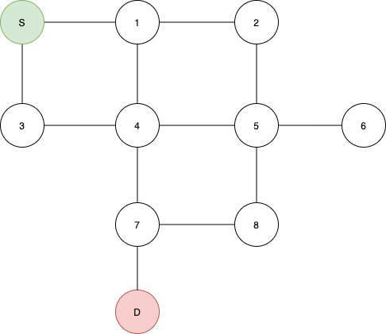
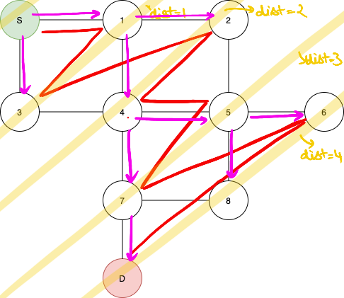
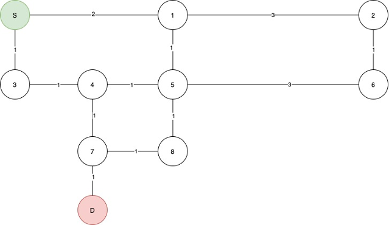
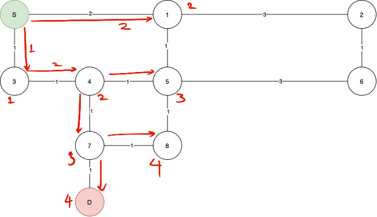
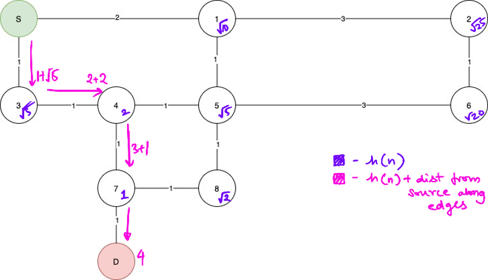

Terminology used:
•	Vertex: A ‘node’ of a graph

•	Edge: Connects vertexes.

•	Adjacency list: A list of vertices that are connected by an 
edge. It is more space efficient than an adjacency matrix, but unfortunately doesn’t have o(1) lookup time.

•	Stack: A FILO data structure. At a high level we can understand it to be a data structure such that the first elements input into the stack are the last to exit.

•	Queue: A LIFO data structure. Like a queue in real life, the first object to enter the queue is the first one to exit.

This discussion will pertain to graphs.
So what are pathfinding algorithms? Simply put, they are algorithms that, when used, can find a path and distance of that path between a source node and a target node in a graph.

The example graph we will be referring to: 

<!-- //image -->


The ‘naïve’ methods:

1.	DFS (Depth first search)
A brief description of this approach is that it very basically just goes as far down as possible. So for the given example, this is what the path *might* look like:
    <!-- // iimage -->


It’s quite interesting to think about WHY this works, so the algorithm can be easily simulated with a recursive call or an even an iterative approach that involves a stack. At each vertex, the function calls the function for every vertex that resides in the adjacency list of that vertex and that have not been visited before. So at each instance for each vertex we go one level deeper for all the vertices that we can.
Its runtime complexity is O(N).


2.	BFS (Breadth first search)
This works because at each level (defined here as the minimum distance from the source to that vertex), vertexes of the successive level are queued up for checking.
This algorithm ensures that the distance to each vertex found is the minimum distance from each vertex IF the edges have the same weight.
This is what the order of execution might look like: 

  

The explanation for how this works Is quite simple to understand. We use a queue for the implementation. At each vertex, each successive vertex that is connected to the current one is inserted into the queue. It is easy to see that points are inserted into the queue in such a way that the nearest points are inserted into the queue first.
Each vertex is visited once without any any repetitons.

As mentioned before BFS gives the shortest path to everynode in an UNWEIGHTED graph.
Why doesn’t it work though? If the source node is s and the destination is D and there is a node in between them called M. We create edges S->M with weight 1, M->D with weight 2,  and S->D with weight 10.

```
    S
    |  \(1)
(10)|  M         
    |  /(2)
    D

```

So what do you do for a weighted graph?
With BFS, the distance we would get would be 10 as its only one edge long wheras, the other path is 2 edges long.

How could we possibly solve this? Now if the queue for BFS is replaced by a datastructure that provides the shortest node at everypoint, a datastructure that do it as fast as possible.

A priority queue or a heap is one such datastructures. It provides the smallest element in O(logN) time. 

A minheap is a data stucture that is a complete binary tree that, at each node, both children are greater than or equal to than the parent. At an insert operation, a new node is inserted in o(logN) as that is the maximum height if the tree, and at max, it would need to swap atleast the height of the tree times, or log(N).


DIJKSTRA’S ALGORITHM:
This is basically what we’ve been talking about, it uses a priority queue, basicly a minheap.
For an unweighted graph, dijkstra’s will look a lot like BFS, which is why we will employee this graph:


 


The algorithm will work like this, the numbers near the nodes are the distances from n



 

As you can see not all of the nodes have been visited. And by the nature of the algorithm, the distance to each node is always the minimum distance from the center.

But can we improve upon this?

You might have observed that the algorithm, prioritizes nodes over each other with the path length from the source node. What if we had MORE information, namely a heuristic.
For this example we’ll be looking at the absolute displacement of every graph from the destination.
This does imply some computation, and also requires a graph that includes this data. We should also know the endpoint.

A* ALGORITHM:
	Almost exactly same as dijkstra’s BUT, instead of putting the path length from the source into the priority queue we will be inserting the sum of the path length from source AND the displacement from the destination.

We use a heuristic to control the algorithm h(n).
In this case we will take h(n) to be the absolute displacement between the destination node and the nth node.



 

As you can clearly see, this is waay more efficient than dijkstra’s, and its implementation is pretty similar, the only difference being that instead of using the distance from source into the priority queue, we can use h(n) + the distance from the source to the node.
