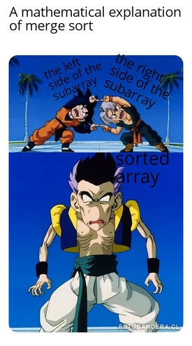

Invented by John von Neumann in 1945, MergeSort was one of the most innovative and efficient sorting algorithms of it's time and is a classic example of divide and conquer algorithms. 

## How does MergeSort work?

MergeSort is comparison-based sorting algorithm, i.e. it compares elements each step of the way to decide the final ordering of the elements. What sets MergeSort apart from other comparison-based sorting algorithms, is its use of the divide and conquer methodology (similar to QuickSort). MergeSort sorts a list of elements, by repeatedly breaking the list down into smaller sub-lists and sorting those sub-lists individually.

MergeSort consists of two main steps, splitting the list and merging two sorted lists. The core idea is that it is easier to appropriately combine two sorted sub-lists of a list (i.e. combine them such that they form a sorted list) than it is to sort the list directly. Sorting a list directly (with other sorting algorithms like selection sort, bubble sort, etc.) is an operation with time complexity $$O(n^2)$$, but combining two sorted sub-lists is an operation with time complexity $$O(n)$$.

Now we need to obtain these sorted sub-lists. One way we could do this is to check if a sub-list is sorted and if it isn't we split it into two more sub-lists and repeat the process on the newer sub-lists. The issue here lies in checking if a sub-list is sorted. This operation ends up greatly increasing the time it takes to fully sort a list. Instead, what MergeSort does is it breaks down the list into the smallest possible sub-lists, i.e. sub-lists with only one element. All of these sub-lists with one element are sorted sub-lists and thus, all that's left is to appropriately "merge" these sub-lists.

{:refdef: style="text-align: center;"}
<a href="https://commons.wikimedia.org/wiki/File:Merge-sort-example-300px.gif#/media/File:Merge-sort-example-300px.gif"></a>
{: refdef}
<br><i>By <a href="//commons.wikimedia.org/w/index.php?title=User:Swfung8&action=edit&&redlink=1" class="new" title="User:Swfung8 (page does not exist)">Swfung8</a><span class="int-own-work" lang="en"> - Own work</span> <a href="https://creativecommons.org/licenses/by-sa/3.0" title="Creative Commons Attribution-Share Alike 3.0">CC BY-SA 3.0</a>, <a href="https://commons.wikimedia.org/w/index.php?curid=14961648">Link</a></i>
<br><br>

To recap, MergeSort takes a list of elements, breaks it down into many sub-lists with one element each, and appropriately combines these sub-lists to finally get the sorted version of the given list.

{:refdef: style="text-align: center;"}

{:refdef}

## Sample Code:

```cpp
// MergeSort consists of 2 functions which we will call split_n_sort() and merge().
// Here we use MergeSort to sort an array of numbers in C. You can use MergeSort to sort almost anything, but you will need to adjust your comparator accordingly.
void merge (int l, int m, int r, int * arr)
{
    int left_size = m - l + 1, right_size = r - m;
    int L[left_size], R[right_size];
    
    for(int i=0; i<left_size; i++)
    {
        L[i]=arr[i+l];
    }
    for(int j=0; j<right_size; j++)
    {
        R[j]=arr[j+m+1];
    }
    
    int i=0;	// iterator for L
    int j=0;	// iterator for R
    int k=l;	// iterator for arr
    
    // Now we compare the elements of L and R and insert them into arr based on our comparator.
    // The comparator is defined by the programmer and can be changed according to what is needed.
    // Ex: It can be used to sort strings alphabetically or sort dates chronologically. The way the comparator is defined changes how MergeSort sorts a given array/list.
    
    while(i < left_size && j < right_size)
    {
        if(L[i]<=R[j])		 		// This is the comparator, the "L[i] <= R[j]" part.
        {						   // We use this specific comparison to sort the array in ascending order.
            arr[k]=L[i];
            i++;
        }
        else
        {
            arr[k]=R[j];
            j++;
        }
        k++;
    }
    
    // The following two while loops are used to flush out any remaining elements in either L or R (only one of them will be non-empty). The remaining elements will be greater than the last insrted element.
    while(i < left_size)
    {
        arr[k] = L[i];
        k++;
        i++;
    }
    
    while(j < right_size)
    {
        arr[k] = R[j];
        k++;
        j++;
    }
}

void split_n_sort(int l, int r, int * arr)
{
    if(l<r)			// We split the array/sub-array if it has more than one element.
    {
        int m = (l + r - 1) / 2;
        split_n_sort(l, m, arr);
        split_n_sort(m+1, r, arr);
        
        merge(l,m,r,arr);
    }
}
```

## Time Complexity

The time complexity of MergeSort in its worst and best cases are $$O(n * log(n))$$ and $$\Omega(n * log(n))$$ respectively. The time MergeSort takes to sort is independent of the values themselves or their ordering, and only depends on the number of values it has to sort. This makes MergeSort a very consistent sorting algorithm.

## Space Complexity

The space complexity of MergeSort is $$O(n)$$. At first, it may seem like its space complexity is $$O(n*log(n))$$ (especially if you draw out the splitting and merging), but it is not. This is because the code for MergeSort is a "Depth-First" code. This is concept commonly seen in graph traversal (you can check out our article on that [here]({{ site.baseurl }})). Essentially what it means is that because MergeSort merges from the smallest arrays upwards, the amount of memory being used at any given time is capped at $$O(3n)$$. Thus, MergeSort has a space complexity of $$O(n)$$.

## History

The idea of merging comes from a card-walloping machine, *the collator* (invented in 1936). Using it's two feeding stations, it could merge two sorted decks of cards (cards here refers to the punched cards popularly used by IBM) in a single pass (this is the $$O(n)$$ operation we use to merge two sorted arrays). Using this as inspiration, Jon von Neumann then invented internal merge sorting in 1945, in order to test the adequacy of some instruction codes he was proposing for the EDVAC computer.
