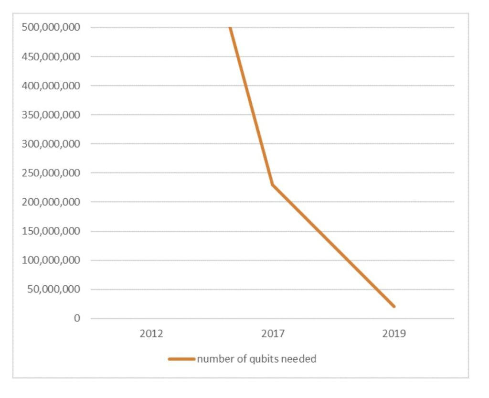

With the advent of computer science and information technology and their widespread usage in the world being evident, it was crucial that the data that was involved in information transfer was safe and secure. This led to the implementation of encryption techniques and algorithms, which needed to far surpass the current computational capabilities of computers so that they could keep data secure for the foreseeable future. One of these encryption algorithms that emerged as one of the more popular encryption techniques was RSA encryption, being widely used in the encryption of data in web browsers, chat applications, email, VPNs and several other technologies. RSA encryption, who’s algorithm was devised in 1976, could not be broken by the computational power of classical computers at the time, and it looked like it would be safe for the foreseeable future. However, the creation of quantum computing showed that this barrier could potentially be broken. Well if data encryption could possibly be broken by quantum computing, wouldn’t that mean that a large portion of information transfer could possibly be at risk? What would happen in that case? Would anyone be able to obtain our private and previously secure data, such as our messages and passwords? Will the world as we know it dive into chaos and end??? First, let’s gain a basic understanding of RSA encryption and why classical computers couldn’t break it while quantum computers might be able to one day.

## What Is RSA and Quantum Computing???

The crux of RSA encryption lies in the fact that when given a number that is the multiple of 2 large prime numbers, it is extremely hard to find those two factors. The way that we can break/decrypt data encrypted using such a large number is to find these 2 factors. Most algorithms use the same method, first start with a random guess, then analyse and get a better guess out of this. The process of getting a better guess is generally pretty slow. The best current approach that we have on a classical computer, General Number Field Sieve (GNFS) is still pretty slow and impractical in real-world situations. However, if we have a quantum computer with a high computation power, we could use Shor’s algorithm to break it. Shor’s algorithm takes advantage of concepts like quantum superposition and quantum interference, which can be implemented with a, ***surprise surprise***, quantum computer. Shor's algorithm makes the process of finding these 2 factors a lot more efficient and faster compared to other algorithms as it makes the process of getting a better guess from the previous guess a lot more quickly. Well if this is just an algorithm shouldn’t it be able to be run on any computer? Well, actually yes, we can run it on a classical computer but it is a lot slower than if we could run it on a quantum computer with high computation power owing to the fact that it is a lot better at implementing quantum superposition and quantum interference. Essentially, using quantum superposition, a quantum computer calculates a bunch of possible answers, or in this case, better guesses, from a given single input. It then assigns different probabilities to each possible answer and then arranges them in such a way that the bad guesses cancel/interfere with each other (quantum interference), and we’re left with the best possible guess out of all the ones that were generated. After we generate a guess, we check if it is a solution, i.e. a factor of that huge number that we were initially given. If it is, yay, we’ve broken through, but if it isn’t, no worries, just repeat the same process and keep on generating better guesses until we arrive at a factor.

## Future of Encryption and Quantum Computing

However, until we have a quantum computer that has the amount of computational power to run Shor’s algorithm at the level that we need to break RSA, we can’t really do anything with this information. The computation power of a quantum computer relies on the number of quantum bits, or qubits that the computer can stably hold at a time. The more, the better. Currently, Google has the record for the highest number of qubits in a quantum computer with 72. That’s miles away from what we need to be even close to breaking RSA encryption. A 20 million-qubit quantum computer could break 2048-bit RSA encryption in 8 hours, a task that takes a classical computer 300 trillion years to do. Also, improvements in quantum computer architecture and algorithms used, reducing qubit error percentage, lowers the number of qubits we require, potentially going as low as just 4099 qubits breaking 2048-bit RSA encryption in 10 seconds if all the qubits are perfectly stable. To get the technology to a level that we could break RSA encryption in practical times, experts predict that it could take around 25 years.

Number of qubits required to break 2048-RSA encryption over the years

  
Again, this is just a prediction, but what we do know for sure is that we won’t need to worry for the next decade or 2. However once quantum computers get enough computational power, our current standards for encryption just will not cut it. People with the necessary hardware will be able to break our current standards for encryption and access data encrypted using these methods. Then won’t that be a major security issue? People would potentially be able to access secure information and wreak havoc, right? Well, not really. Like how computing power is making advancements, so are encryption techniques and algorithms. By the time that quantum computers good enough to break RSA come around, there likely will be stronger encryption techniques in common use that can’t be broken by Shor’s algorithm. In fact, McEliece encryption is an encryption technique that is immune to Shor’s algorithm that was devised way back in 1978. Several current cryptographic algorithms, such as some symmetric cryptographic algorithms and hash functions, are considered to be relatively secure against quantum computers and Shor’s algorithm. But even if any of these aren’t ideal, a new algorithm will probably be devised by then, and our data will be safe.

Long story short, even though quantum computers potentially will have the capability to break current encryption techniques, that is a long way in the future, and we will likely have stronger encryption techniques in place. So no need to panic, your data is safe, that is unless the North Koreans have secretly already achieved quantum supremacy and are currently taking all the money out of your bank account.