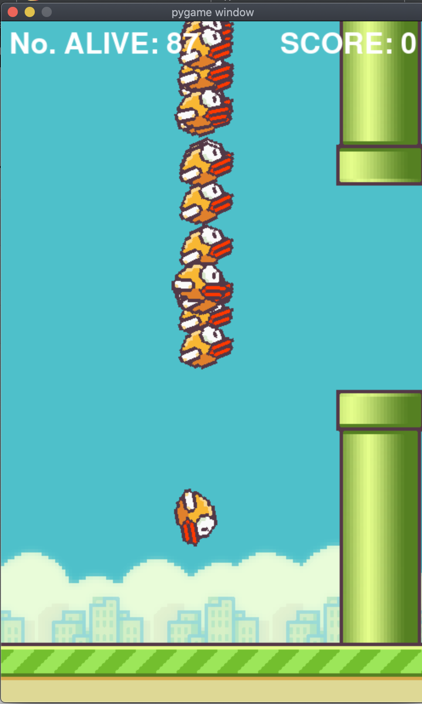
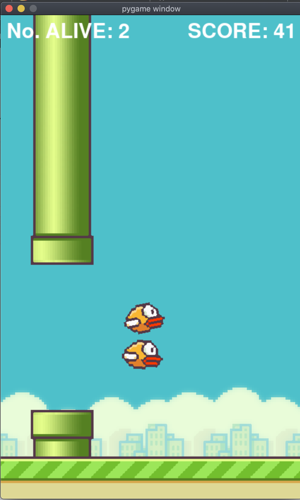

Neat or Neuro-Evolution of Augmenting Topologies

Survival of the fittest, the very essence of evolution, has shaped much of our world. We can quickly see how this is effective. It takes the strongest properties of each generation and propagates them through the next generation. Now, what if we could do this with neural networks? It would be pretty lit.

So first, what's a neural network (NN)? It's at its most basic level a structure that resembles a brain. Connections between neurons are represented by a number (weight), upon which a linear operation that includes all the nodes of the previous level are taken into account. And an activation function controls the output of the node.

So concisely, NEAT just takes a bunch of neural-networks, and after evaluating their fitness, the best performing NNs are made to 'breed' to get the next generation of NNs.

As you can tell, It follows nature.

But you know that it can't be that easy, right? Never is. Allow me to go into further detail.

First off, we will refer to each connection between the neurons as a gene.

We have to define certain rules for evolution. NEAT allows new connections between nodes, mutation of nodes, and most importantly, the inheritance of the best performing NNs.

Mutation can consist of adding new structure to a NN, or we can new structure to a network. 

Speciation, like in nature, keeps certain NNs from breeding with each other, that is it splits up the population based on similarity of topology or connections of the neural nets.

So to make stuff easier lets base the rest of the article on using neat for a bot to play a game, in this case we will talk about flappy bird.

The objective of the game is to get as far as possible, while going through obstacles without dying.. A neural net that could play this would require around three inputs( the heights of the bird, the top pipe, and the bottom pipe) and one output, jump.

So the first generation as predicted, sucks, they cant get past the 2nd level. 

Most of them, don’t know how to use the inputs, they don’t know that interacting with the pipe will kill them, they don’t know that jump increases their y coordinate, etc.
But as the evolution proceeds, the ones that ‘understand’ these rules are selected for ‘breeding’ and thus the child generation has that knowledge encoded in its genes.

But by around the fifth one, they excel, and are in essence unbeatable. The only reason that they perform so well so fast , is that the NN required is exceedingly simple.

Links to my neat projects: 

[flaPy bird](https://github.com/saru-d2/flaPy_bird). 

[PyONG](https://github.com/saru-d2/PyONG). 

