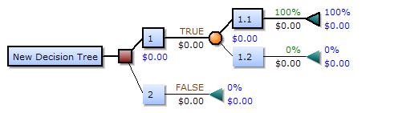

Decision Tree is a tree-like decision tool to map out decisions and possible consequences. It has influenced a large option of machine learning, covering classification and regression. It is a way to display an algorithm which only contains conditional control statements and are commonly used in decision analysis, to study strategies to reach a goal.

## Implementation

A decision tree has 3 types of nodes:
- Decision nodes – typically represented by squares
- Chance nodes – typically represented by circles
- End nodes – typically represented by triangles

If we have n features then we need n candidate splits. An error function then chooses which split has the least error, and the split with the least error is kept. This algorithm is recursive in nature as formed groups can be further divided using the same strategy. Using this greedy algorithm the root node makes the best predictor/classifier.

## Splitting Nodes

### Regression:

The cost function is:

$$\Sigma (y - prediction)^2$$

 The tree is split keeping considering each feature in training data. The mean of training data is considered as the prediction of that group.

### Classification:

Gini Score:

$$G = ∑(pk*(1 - pk))$$

Gini score is used to decide how good a split is. Here, pk is the proportion of the same class inputs present in a group. So, for a binary classification pk = 0.5 and G = 0.5.

## Advantages and Disadvantages
### Advantages:
- Simple to understand and understand as they are a flow chart like a representation of conditional statements.
- Can be combined with other models and decision techniques.
- Can generate decent actuaries even with a little training data.
- Help study the worst, average and best case values for various scenarios.
### Disadvantages:
- They are unstable. Small changes in data can drastically change the most optimal tree.
- Are often considered to be relatively inaccurate. However, an average of a bunch of them (Random Forest) is used to tackle this.
- Often get complicated when many values are missing.
- Growing the tree needs to be controlled in the aspect that only the necessary features are used.

## Decision Tree Pruning
This is a method used to reduce the complexity of a tree. Here, a branch of the tree is removed if it uses features of low importance. This is a method of preventing model overfitting. 
### Bottom-Up
This is started at the lowest node of the tree and is continued recursively upwards. If there is no relevance (accuracy doesn’t deteriorate) for a branch or a leaf then it is removed. This method is advantageous as no relevant subtrees are removed. E.g: Reduced Error Pruning
### Top-Down
This method starts at the root node and is continued recursively downwards, here there is a chance of losing relevant sub-trees. Eg: Pessimistic Error Pruning
