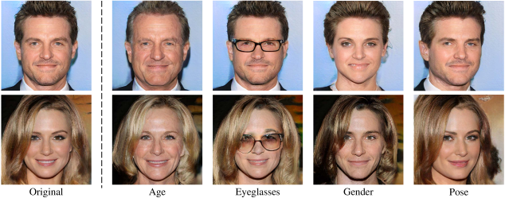
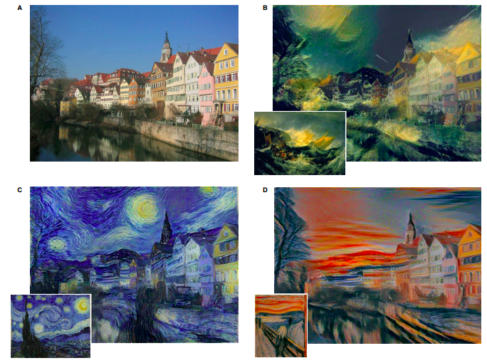

In the [previous article of this series]({{ site.baseurl }}), we dived into the field of what GANs are and gained a basic understanding of how GANs work. A quick recap. Generative Adversarial Networks (GANs) are a subset of machine learning which creates new data based on training data that it has been supplied (for example if you give a bunch of images of peoples’ faces, it can generate new real-looking images of faces of people that do not exist).

## Applications and Examples

GANs have a bunch of applications. We can pretty much create anything given a bunch of related data.

**Image Generation** - Given a bunch of images of faces, cats, anime characters or any other related set of photos, a GAN can create a new image that resembles those images. Websites such as [https://thispersondoesnotexist.com/](https://thispersondoesnotexist.com/) have been a big reason for GANs gaining popularity and mainstream media attention. Image to image translation can be utilized for tasks such as converting satellite photographs to Google Maps, editing details from day to night and vice versa and transforming black and white images to colour. GANs have also been used to construct front-on photos from angled pictures and new human poses, such as for models.

**Editing Photographs** - GANs can be used to reconstruct faces to identify changes in features such as hair colour and facial expressions. This can help in the identification of criminals who have undergone surgeries to modify their appearance. Face aging can also be used to create facial images of people at various ages, which can help in the identification of people who have gone missing for several years. GANs can also be used to edit images to make them more appealing, such as by removing rain and snow.

<i>Editing Photographs Using GANs</i>

**Artwork Generation** - GANs can be used to generate artwork. It is also used in Image Style Transfer which involves the changing of a piece of artwork from one style to another. For example if we are given an abstract painting, you can use a GAN to change that same painting into a realism or an impressionism painting. We can also incorporate the type of art and fuse it with a real life image.

<i>Image Style Transfer</i>

**Music Generation** - GANs can also be applied to non-image domains to generate music (as long as the data is related, we should be able to generate new data with a GAN)

**Cybersecurity** - GANs can be trained to identify instances of fraud, such as by identifying malicious information/data added to images by hackers. The [Secure Steganography Based on Generative Adversarial Networks](https://www.researchgate.net/publication/318258864_SSGAN_Secure_Steganography_Based_on_Generative_Adversarial_Networks) technique is used to analyze and detect malicious encodings that should not be part of images.

**Healthcare** - GANs can be used in medical tumour detection by comparing images of healthy organs with images of organs which possibly contain tumours and detecting anomalies in them. Using GANs results in faster and more accurate detection of tumours, saving costs for both patients and doctors. GANs also assist in the field of drug discovery, where researchers can train the generator with existing 

**Video Generation** - Video Prediction has been done using GANs, with models created which predicted up to a second of video frames based on the previous video. For example if a video of a ball being kicked was shown only up to a certain part of its trajectory, the GAN would generate the next second of the video with the ball traveling in the same path as it actually did in real life. One famous use of GANs in video generation is in Deepfakes. Deepfakes are fake video and audio recordings generated using GANs. Using images and videos of people, we are able to edit those videos and images to make it seem like it is another person present in those videos or edit a person’s audio and lip movement to make it look like they are saying something different. This can be taken advantage of maliciously as well to be used for malpractices, a discussion which we will embark on in the next and [final article of this series]({{ site.baseurl }}).

<iframe class="embed-responsive-item" src="https://www.youtube.com/embed/cQ54GDm1eL0" frameborder="0" allow="accelerometer; autoplay; clipboard-write; encrypted-media; gyroscope; picture-in-picture" allowfullscreen></iframe>

