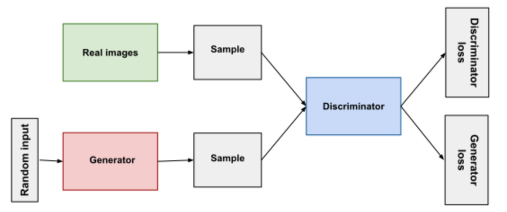

In this series of articles, we will be exploring the world of GANs, starting with an introduction to and the basic working of GANs. After this we will see various examples and real-world applications of GANs. Finally we will look at the social implications of GANs.

## What are GANs

**Generative Adversarial Networks** or GANs for short have been in talks since the fast few years mainly due to the popularity of websites like [https://thispersondoesnotexist.com/](https://thispersondoesnotexist.com/) etc. which generate real-looking fake faces, leading to much-expected speculation and discussions around it. GANs are a subset of machine learning and work similarly to ML models. While most ML algorithms create models based on training data in order to make predictions related to new unseen data points, GANs train themselves with training data in order to generate new data based on the training data that they have seen. 

<i>A few real-looking faces generated using GANs (source: https://thispersondoesnotexist.com/)</i>

## How GANs Work?

In simple words, GANs function using two components - A **Generator** and a **Discriminator** which are networks that work together through training.

The Generator creates new data based on the previous training data that it has been supplied.

The Discriminator then takes this newly formed data and tries to identify if this is real data, i.e. actual data that was collected or fake data, i.e. data that was generated by the generator.

Essentially the Generator is trying to fool the Discriminator while the Discriminator is trying not to be fooled by data generated by the Generator. This technique is known as **adversarial learning**, hence the ‘Adversarial’ in GANs, where we try to fool models by giving them deceptive data as inputs. This process of generating and testing generated data continues on and on, and the model keeps on learning and getting better at both generating data that resembles the training data more and discriminating between real and generated data by learning from their mistakes.

<i>Architecture of a GAN</i>

## Math behind GANs
The Generator and Discriminator play a type of zero-sum game with the **minimax method**. In a zero-sum game, each participant’s gain or loss is balanced by the losses and gains of the other participants, in this case, if the Generator performs well, the Discriminator gets worse and vice versa. Minimax is an algorithm/method that we are using to **minimise the worst-case loss** which is the amount of cost associated with an event, in this case, a term that reflects the distribution of fake data. The loss function that was used when GANs was first introduced is -

$$E_X[log(D(x))] + E_Z[log(1-D(G(z)))]$$

Where,
- $$D(x)$$: discriminator's estimate of the probability that real data instance x is real.
- $$E_x$$: expected value over all real data instances.
- $$G(z)$$: generator's output when given noise/input $$z$$.
- $$D(G(z))$$: discriminator's estimate of the probability that a fake instance is real.
- $$E_z$$: expected value over all random inputs to the generator (in effect, the expected value over all generated fake instances $$G(z))$$.

Even if you didn’t understand any of what was written in that equation, that’s okay. Essentially, the Generator tries to minimise this function while the Discriminator tries to maximise it, i.e. maximise $$D(x)$$ and $$(1-D(G(z)))$$.

For the generator to succeed perfectly, the discriminator must have a 50% accuracy, which means that it can not distinguish between real and fake data and is pretty much just guessing. We then optimise this function by iterating both the Generator and Discriminator via a **gradient descent**, which is an optimization algorithm that minimises a function by moving in the direction of the steepest descent until it reaches a local minimum. Eventually, we get a GAN that creates fake data that should generally be unrecognisable from real data.

## Conclusion
In this article, we’ve understood what exactly GANs is and how it works. Then what can we do with GANs? Where can it be implemented? We’ll be looking into the [applications of GANs]() in the next article of this series.

[Next in Series](https://www.youtube.com/watch?v=dvdT2gQfzqM)
