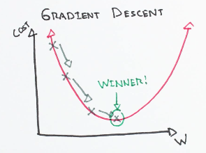
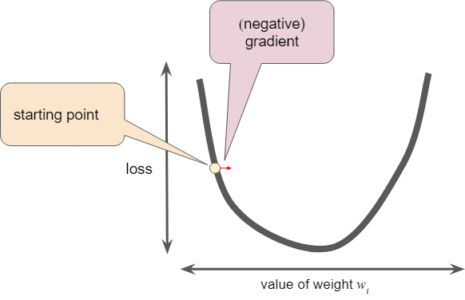

&nbsp; &nbsp; &nbsp; &nbsp; Gradient Descent is a simple yet efficient approach to fitting linear classifiers and regressors. Even though it has been around for a long time, it has just recently received a considerable amount of attention and is used in Text classification and Natural Language Processing. It is not a machine learning model but is a method which may be used to train models. 

## Working
&nbsp; &nbsp; &nbsp; &nbsp; Gradient Descent is used to optimize the parameters used in machine learning models. An intuitive method of imagining this is: Consider an n-dimensional cost function, where n refers to the number features we wish to optimize. We aim to find the set of parameter values for our model such that the cost function in the training data is at the minima in the n-dimensional cost function.



&nbsp; &nbsp; &nbsp; &nbsp;We attempt to take steps along the function to reach the minima.

## Mathematics
&nbsp; &nbsp; &nbsp; &nbsp; Let us assume that we are attempting to optimize a parameter w1. Using this we can find the slope along the function, giving a clue as to which direction we should consider our next ‘step’ in. As we get closer to the minima, the magnitude of the slope will keep decreasing, we can use this fact to decrease our step size. This step size I called the learning rate, with a large value we can skip a large region in our downwards descend and a smaller value allows for more accurate values as it’s less likely that we would jump over the minima.

&nbsp; &nbsp; &nbsp; &nbsp; As we move to a greater number of parameters, we get a set of equations and we have to start using vectors (arrays in code) to keep track of individual weights as we try to decrease the value of the cost function.



## Implement Gradient Descent
1. Randomly initialize values.
2. Update values:

3. Continue the process until slope = 0. Due to floating point error, we usually use slope < Very Small Value

## Advantages and Disadvantages 
### Advantages:
- Computationally fast
- Efficient for large datasets.
- Ease of implementation.
### Disadvantages:
- Frequent updates and computationally expensive.
- External noise minima can be hard to find.

### Python Implementation
```
from sklearn.linear_model import SGDClassifier
X = [[0., 0.], [1., 1.]]
y = [0, 1]
clf = SGDClassifier(loss="hinge", penalty="l2", max_iter=5)
clf.fit(X, y)
SGDClassifier(max_iter=5)
clf.predict([[2., 2.]])
```
Output:
```
array([1])

```