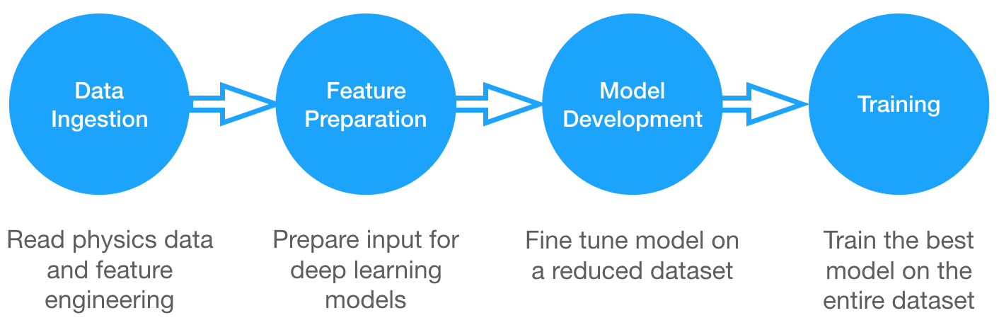
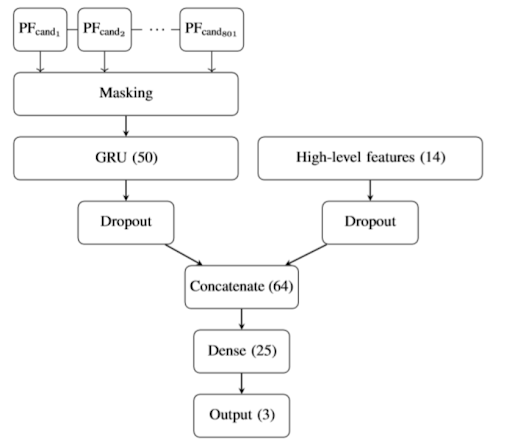
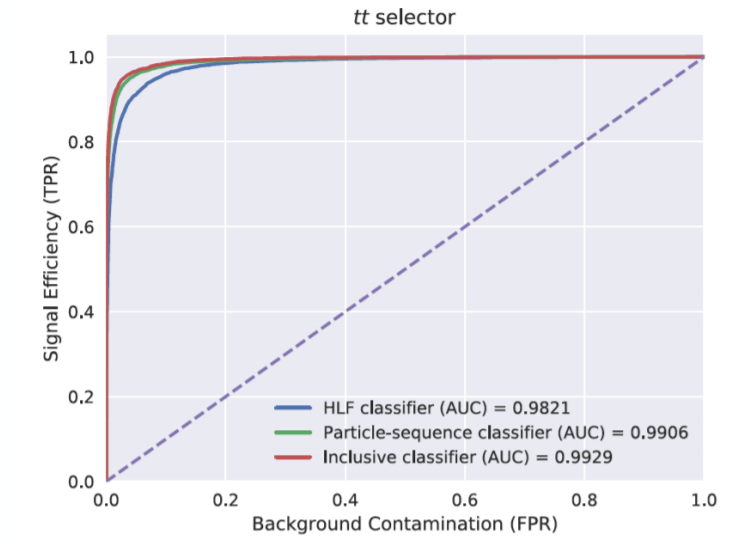
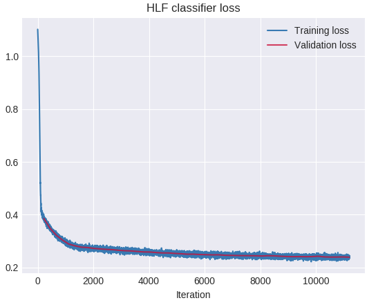

&nbsp; &nbsp; &nbsp; &nbsp; We will be discussing some of the easiest machine learning tools and Pipelines used in high energy physics.

## Why do we need ML? 
&nbsp; &nbsp; &nbsp; &nbsp; Machine techniques are used in a High Energy Physics (HEP) environment as there is a desperate need for a perfect filtering system. The aim is to develop a Deep Learning classifier, with a goal of identifying events of interests and reducing false positives. These false positives can take up a lot of space and are a waste of computational resources and hence increase the cost of operation. Classification algorithms are being used to improve the real-time event selection at the LHC. Deep Learning models would complement or replace the need for rule-based classification algorithms. 

&nbsp; &nbsp; &nbsp; &nbsp; Let us begin by defining the interactions we are going to be studying. When we talk about particle collision interactions take place at the LHC. The amount of data flowing at the facility easily touches Petabytes per second. An experiment can generate up to a petabyte of raw data per second. The plan is to use classification systems to filter out the interesting events, which after several layers of classification algorithm comes down to a few gigabytes per second.

## Pipeline



### Extending Spark to Read Physics Data
&nbsp; &nbsp; &nbsp; &nbsp; All the data is stored in the CERN EOS storage system in the ROOT format, which can be accessed by Spark via the XRootD protocol. The Spark Datasource now has the ROOT format, the raw data contains arrays of simulated particles and their properties. There are 50+ million events stored in this data frame.

### Data Ingestion
&nbsp; &nbsp; &nbsp; &nbsp; 4.5 TB of data is read from the ROOT format. It is then stored in Python and PySpark code using Jupyter notebooks.
```
myDF = spark.read.format(“root”).load(“root://eos...”)
myDF.count()
```
&nbsp; &nbsp; &nbsp; &nbsp; This is then followed by feature engineering. Here only events of interest are kept and feature labels are added to the data. 14 additional features are calculated from these “low-level features” and are called the “high-level features”.

&nbsp; &nbsp; &nbsp; &nbsp; Event filtration then takes place and we get a write output of about 950 GB (25M events) in the Parquet format. Even on 400 cores, the ingestion can take up to 3 hours

### Feature Preparation 
The following features are converted in the data:
- One Hot Encoding of Categorical variables.
- MinMax scaler for High-Level Features.
- Sorting Low-Level Features: prepare input for the sequence classifier, using a physics metric.

This results in:
- 317 GB of data, about 3.6 Million events
- Shuffled and split training and testing data.
- A python code using PySpark, Spark SQL and ML

### Model Development
&nbsp; &nbsp; &nbsp; &nbsp; The model is made using the Keras-compatible API of Analytics Zoo. Here, we will combine a GRU of low-level features with a DNN of high-level features  The topography of the Neural Network is given as:



&nbsp; &nbsp; &nbsp; &nbsp; An estimator function is then instantiated and the model is trained. The model is then stored for later use.
```
trained_model = estimator.fit(trainDF)
train_model.save(“Path”)
```

### Training with TensorFlow 2.0
&nbsp; &nbsp; &nbsp; &nbsp; The data can be stored in TFRecord format for use by TensorFlow by Spark. Data ingestion is then done by Tensorflow and undergoes distributed training using: ```tf.dustribute```.

&nbsp; &nbsp; &nbsp; &nbsp; The distributed training occurs on Kubernetes (CERN Cloud). There is a 10x speedup when TensorFlow 2.0 uses GPUs for the training.

## Model Performance



