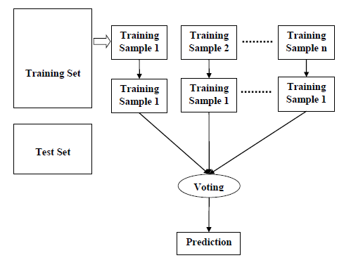

&nbsp; &nbsp; &nbsp; &nbsp; Random forest is a method for classification, regression and other tasks. It works by constructing a multitude of decision trees at the training stage. In classification, the mode tree is returned and in regression the mean of the result of the individual decision trees. It is an ensemble method which is better than a single decision tree as it prevents overfitting by averaging the results.

## Working 
&nbsp; &nbsp; &nbsp; &nbsp; First, the algorithm selects random samples from the dataset. A decision tree is then produced for each sample generated. The predictions are done using these trees. Next, a voting step is involved to get the averaged prediction. The final prediction result is returned. One further step is to add extremely randomized trees who are trained using the entire training data and the top-down splitting in the tree training is also randomized.



&nbsp; &nbsp; &nbsp; &nbsp; Usually, in classifications with p features, √p features are used in each split and in regression p/3 with a minimum of 5 are used. In practice, the distribution of these depends on the problem at hand.

## Advantages and Disadvantages 
### Advantages:
- It prevents overfitting by averaging and combining several results.
- This works for larger range values than a single tree.
- They have lower variance, higher flexibility and accuracy when compared to a single tree.
- This maintains a decent accuracy when a large proportion of data is missing.
	
### Disadvantages:
- This has a larger complexity compared to decision trees
- This requires larger computational resources.
- Construction is harder and more time-consuming.
- The prediction takes longer when compared to other algorithms.

## Overfitting and Underfitting
&nbsp; &nbsp; &nbsp; &nbsp; Overfitting and underfitting are the two biggest causes for the poor performance of machine learning algorithms. The goal of a good machine learning model is to generalize well from the training data to any data from the problem domain. This allows us to make predictions in the future on data the model has never seen.
&nbsp; &nbsp; &nbsp; &nbsp; Overfitting happens when a model learns the details and noise in the training data to the extent that it negatively impacts the prediction performance for unseen data. This usually happens when the model picks up noise or fluctuations and learns it applying it in future predictions. Underfitting happens when the model doesn’t learn enough relations to perform seen and future predictions. The aim of machine learning models is to find the sweet spot between overfitting and underfitting to find the best possible accuracy for that specific model.

## Python Implementation
```
>>> from sklearn.ensemble import RandomForestClassifier
>>> from sklearn.datasets import make_classification
>>> X, y = make_classification(n_samples=1000, n_features=4,
...                           n_informative=2, n_redundant=0,
...                           random_state=0, shuffle=False)
>>> clf = RandomForestClassifier(max_depth=2, random_state=0)
>>> clf.fit(X, y)
RandomForestClassifier(...)
>>> print(clf.predict([[0, 0, 0, 0]]))
[1]
```