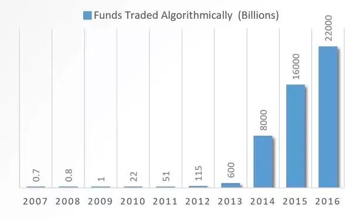
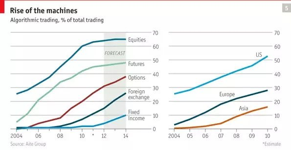

## What is Trading

Trading essentially is the exchange of goods and services between two entities. In this article, the trading that we are talking about pertains to the stock market. In the stock market, traders can buy and sell stocks and shares, which represent ownership in a company. If you own stocks in a company and the value of the company increases, the value of your stocks increase, and you can sell them, gaining a profit. The opposite is also possible, so it is paramount to make smart investments based on data related to the company and market. For example, if a company has been losing money for a while, it probably isn’t the best idea to buy shares in that company, that is unless you want to lose money. Historically, trading was done solely by humans. Traders look at data related to potential companies that they can buy stocks in and make profits from and buy and sell these stocks to make profits.

## Why Human Traders Suck

Sounds good, right? Well, not exactly. There’s one problem with people looking at this data and making educated decisions about which companies to buy stocks in, it’s too reliant on people. Studies have shown that a large majority of traders are not profitable, with many earning less than minimum wage. This can be attributed to several factors. Humans are subject to emotions, which can end up clouding rational decision making and lead to them making bad purchases, making them lose money. Another problem is due to people being inconsistent with their choices. This boils down to human nature; humans can not be programmed to follow a set of instructions. If a trader made a bad decision that led to them losing money, it isn’t a given that they won’t make the same decision when faced with a similar situation down the line. There is also no guarantee that an individual trader is smart. The trading is as good as the trader. Several other factors come into play, such as time constraints. Unlike undergraduate computer science students participating in hackathons, traders can not work 24 hours a day and aren’t always operating at their highest level. For all these reasons, a new method of trading was developed, Algorithmic Trading.

## Algorithmic Trading

Algorithmic Trading makes the use of pre-programmed algorithms to implement quantitative trading. Quantitative trading is the development of trading strategies with the help of advanced mathematical models. It involves conducting research, gathering historical data, analysing this data and using complex mathematical models to decide which trades have a higher profitability. Algorithmic trading is often used by large institutions that can afford the hardware required to perform the computations required by these complex mathematical models, such as pension funds and mutual funds. Algorithmic Trading addresses most of the issues posed by using people to make trading decisions. Algorithms follow a set of instructions, they aren’t affected by emotions (unless the programmer who coded them up was having a bad day) and have a consistent approach. They don’t need to take bathroom breaks or sleep and can operate 24/7 at their highest level. Another huge advantage is that you can test your algorithm and strategies with historical data. If it doesn’t perform well, improve the algorithm. For these reasons, a large part of the trading market has shifted towards algorithmic trading. 80% of the stock market and a large number of other markets have a large portion of their trading done via algorithmic trading. 4 out of the 5 largest hedge funds specialise in algorithmic trading. Well, that’s a clear shift in favour of algorithmic trading over human traders.

 | 

Trends of Algorithmic Trading in Financial Markets

  
There are multiple algorithmic trading strategies that take into consideration different parameters, that have their own merits and demerits in various situations and markets.

Examples:

> Index Fund Rebalancing - Used in mutual funds and pension funds to find the best stocks to invest in (rebalancing).  
> Arbitrage - Constantly checks for differences between the stock price of the same stock on multiple exchanges. For example, if a share is worth $100 on exchange A and $110 in exchange B, the algorithm finds this, buys some stock from exchange A and immediately sells it on exchange B, getting a profit.  
> Mean Reversion - Calculates the average of a stock’s recent high and low prices. If the stock’s current value is less than this average, the algorithm recognises this and buys shares, waits for the stock price to go above the average as the stock has shown that it is fluctuating around this value, and sells for a profit.

## Conclusion

People suck. We’re emotional, inefficient, lazy and can’t follow instructions. Luckily we have computers and algorithms to make the hard choices for us and earn us money, and with advancements in computer hardware and software and algorithms, there isn’t a limit to what we might be able to achieve with higher computational power and more efficient algorithms.