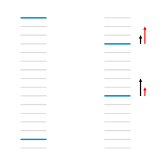

## Learning To Rank

Learning to Rank (LTR) refers to different approaches to construct ranking models through application of supervised or reinforcement machine learning. There is a major difference LTR and traditional supervised machine learning. Where traditional ML (classification solves prediction problems on a single instance at a time and come up with a class or a single numerical score, LTR solves a ranking problem on a list of items at the same time. The main aim of LTR is to come up with an optimal ordering of these items, it doesn't really care about the precise score that each entity gets, but it focuses on the relative ordering among all the items.

The training data for LTR consists of lists of items with some partial order specified between items in each list. There is a "ground truth" score associated with each item, which can be either a numerical/ordinal score or a binary judgement, which induces this ordering of the items. The purpose of the ranking model is to produce a permutation of items in new lists in a similar manner to the rankings in the training data.

One of the most common applications of LTR is Search Engine Ranking, which is discussed later in this article. First, let’s try to understand the basic intuition behind a few ranking algorithms.

## Ranking Algorithms

Some of the common LTR algorithms are RankNet, LambdaRank, and LambdaMart. In all three techniques, ranking is transformed into a pairwise regression or classification problem. This means that you look at pairs of items at a time, and come up with the optimal ordering for that pair of items. These orderings are then used to come up with the final ranking for all the results. Now let us look into these algorithms:

### RankNet

RankNet was originally developed using neural nets, but the underlying model can be different and is not constrained to just neural nets. The cost function for RankNet aims to minimize the number of inversions in ranking. Here an inversion means an incorrect order among a pair of results, i.e. when we rank a lower rated result above a higher rated result in a ranked list. RankNet optimizes the cost function using Stochastic Gradient Descent.

### LambdaRank

During RankNet training procedure, you don’t need the costs, only need the gradients (λ) of the cost with respect to the model score. You can think of these gradients as little arrows attached to each document in the ranked list, indicating the direction we’d like those documents to move.

The core idea of LambdaRank is to use this new cost function for training a RankNet. On experimental datasets, this shows both speed and accuracy improvements over the original RankNet.

### LambdaMART

LambdaMART combines LambdaRank and MART (Multiple Additive Regression Trees). While MART uses gradient boosted decision trees for prediction tasks, LambdaMART uses gradient boosted decision trees using a cost function derived from LambdaRank for solving a ranking task. On experimental datasets, LambdaMART has shown better results than LambdaRank and the original RankNet.

Now that we have talked about some general ranking algorithms, let us focus on Search Engine Rankings.

## Search Engine Ranking

When someone performs a search, search engines scour their index for highly relevant content and then orders that content in the hopes of solving the searcher's query. This ordering of search results by relevance is known as ranking. In general, you can assume that the higher a website is ranked, the more relevant the search engine believes that site is to the query.

It’s possible to block search engine crawlers from part or all of your site, or instruct search engines to avoid storing certain pages in their index. While there can be reasons for doing this, if you want your content found by searchers, you have to first make sure it’s accessible to crawlers and is indexable. Otherwise, it is as good as invisible.

Now let's discuss the two new terms we encountered - index and crawling. These play an important role in how search engines rank webpages.

### Search Engine Indexing

Search Engines store and organize the content found during the crawling process. Once a page is in the index, it’s in the running to be displayed as a result to relevant queries. They process and store information they find in an index, a huge database of all the content they’ve discovered and deem good enough to serve up to searchers.

### Search Engine Crawling

Crawling is the discovery process in which search engines send out a team of robots (known as crawlers or spiders) to find new and updated content. Content can vary — it could be a webpage, an image, a video, a PDF, etc. — but regardless of the format, content is discovered by links. Googlebot (Google's crawling bot) starts out by fetching a few web pages, and then follows the links on those webpages to find new URLs. By hopping along this path of links, the crawler is able to find new content and add it to their index called Caffeine — a massive database of discovered URLs — to later be retrieved when a searcher is seeking information that the content on that URL is a good match for.

Most people think about making sure Google can find their important pages, but it’s easy to forget that there are likely pages you don’t want Googlebot to find. These might include things like old URLs that have thin content, duplicate URLs (such as sort-and-filter parameters for e-commerce), special promo code pages, staging or test pages, and so on.

Now that we know what indexing and crawling are, let's talk about how search engine corporations, like Google, go on to improve their rankings.

### How the Quality of Search Results is Checked

Most major search engines have a human-powered relevance measurement system which acts as an oracle for completeness and correctness. It also lets you measure how good you are relative to your competitors.
It usually works something like this:

1. Generate a sample of a few thousand search queries that users issue on your search engine. The idea here is to get a representative sample of the searches that you want to be able to do a good job at.
2. Issue those search queries on your search engine and extract the top few results. Also extract results for the same queries for each of the competitors that you care about.
3. Train a set of human raters to rate the quality of these results. At the very least, this rating process involves following a set of guidelines which define what an excellent/average/bad search result is. Usually, it's much more nuanced than that and the raters are trained to rate the searches and results based on a bunch of different factors.
4. Repeat the "extract results - rate results" step after regular intervals to ensure you have the freshest set of results and the ratings for these.

This kind of a human-powered relevance measurement system gives you an oracle of what the best results for the representative set of search queries are. This data helps search engines in a bunch of ways, including:

1. You can calculate the same quality metric for your competitors and see how good they are and how they compare against you.
2. You can also calculate this quality metric on various segments of your search query set (e.g. news searches vs. navigational searches vs. local intent searches etc.) and see how each of these segments perform. These tell you what your strengths and weaknesses are. E.g. you might see from this that you consistently underperform for "news" searches compared to your competitors. Going with the stock market analogy, this is similar to a stock index which tracks a specific sector of companies such as the NASDAQ-100 Technology Sector Index.
3. The quality metric lets you see how you improve over time as you update your search ranking algorithms. It also lets you see how your competitors improve over time.
4. This data also serves as a really good training data for training and evaluating your ranking models. In layman's terms, this means you build your search ranking algorithm in a way that it returns the higher rated results above the lower rated results for as many searches as possible.
5. Using this rating data for ranking also helps make your search engine less "gameable" for SEO practitioners. E.g. Let's say instead of human ratings, the search engine uses the number of clicks on a search result as a measure of how good a result is. A "click-based" system like this could be easily exploited for SEO, and websites could boost the rank of their (crappy) results just by paying lots of people to click on their result lots of times.

Google's exact algorithm is a mystery and is going to remain this way for a long time, but this article should give you sufficient idea about how search engines find, interpret, store, and rank content.

