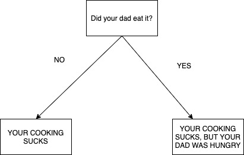
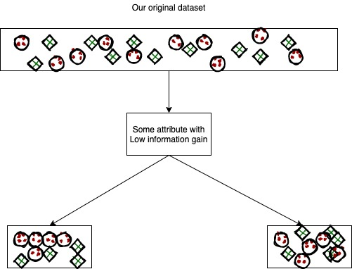

This is an article on Classification algorithms, that continues from the article [From Dictation To Automation]({{ site.baseurl }}). If you want an introduction to Machine Learning, check out [Introduction to Machine Learning]({{ site.baseurl }}). 

As humans, we classify things and beings around us all the time. From the popular jocks who can't add two numbers, to the creepy nerds, who couldn't catch a ball if you held them at gunpoint. From the cute puppy the neighbor has to the scary tarantula the creepy middle aged man who lives opposite your house. From the beautiful piece `Mariage d'Amour` to my horrible attempts at playing the violin, which my mom describes as "the sound of nails on a chalkboard, while surrounded by screaming children in a burning room". Thanks mom. Now I'm writing articles.

As humans, we can classify things with extreme ease. We know instantly if the vehicle coming in to end our life is a car, a bike, or our girlfriend with a shopping cart. It is something we take for granted, and something that is very essential to our lives. 

As it is essential to our lives, if we want to make computers more like us, so that they can do our work for us, we need to teach them how to do the same. This is where `classification` algorithms comes in. 

We will be talking about the following types of classification algorithms here --
- Logistic Regression
- Decision Tree


We will be talking about these in another article.
- Naive Bayes Classifier
- K-nearest Neighbors
- Support Vector Machines

## Logistic Regression
This is a relatively simple way to make a model that can predict binary outcome, like if your crush will say yes or n to you when you ask her if she'll go to the prom with you. Obviously, since this model will only predict either yes or no, it will be wrong, because we know she'll probably say ew and run away. But hopefully you get the point. This a model that is used to predict which of two categories a certain data point belongs to. Let's look at how the model works.

Firstly, logistic regression can be extended to use multiple input values to determine which category a certain case will belong to, we will only deal with the case where we use a single variable to predict the category. We might give a hint of how the model works when using more than one predicting variable.

The core idea behind Logistic regression, is finding the sigmoid function that best 'fits' the model, and using the values given by this sigmoid function to tell the probability of a certain datapoint being in either category. This is fancy pantsy talk for, find best sigmoid function for given data, and use it. Why did I add the fancy pansty talk? Well if someone asks you about this, you can give the fancy answer, and sound much more smart than you actually are. You're welcome. After that, you can claim to understand machine learning and then scare your friends by telling them stories about how this model can predict the future (it can't, but your friends are pretty stupid).

A sigmoid function is of the form
```equation
σ(x) = 1/(1+e^-x)
```
It looks like this


Now how do we find the 'best fit' sigmoid function? 

Ok so it's done like this. We start of with two variables A and B. We define one of the categories as the 1 state, and the other as the 0 state.Our ML model will basically be the following formula at this stage.
```equation
σ(A + Bx)
```
For different values of X, we will get a different value from the sigmoid function that is ur model. This is  essentially the probability that the category of this point is 1. Now, we take our training data, which is basically a table that tells us which category certain values of x belong to. 

We now use a cost function, which is basically a function that tells us how well our current model categorises our training data. Now our goal is to make a model (find values of A and B) such that our cost function is minimum (our model categorises the training data well).

OK so to show you what the cost function looks like, we'll have to talk about some notation first. We have training data, which basically consists of points `(x,y)` where x is the value of the variable we are accounting for in our model, and y is either 1 r 0, indicating the category that particular x belongs to. We will call our sigmoid function (`σ(A + Bx)`) as `H(x)`.

Now, we will define a certain function, that we call `C((x,y), H(x))`, which takes a point in the data and our current sigmoid function. The value it spits out is defined as
```equation
C((x,y), H(x)) = -log(H(x)) if y is 1
                 -log(1-H(x)) is y is 0
```
Notice how, if y is 1, then the higher the value of H(x), the smaller the value of C. This makes sense because, we want a function that gives us a lower value if our model predicts correctly. Similarly for y=0, C is lower if H is lower. Do note that since H give the probability that the given point is in category 1, a higher value oof H indicates that the point has a higher probability of being in one, and a lower value indicates that it has a higher probability of being 0.

Now, the cost function is just the sum of C, when it is applied to all points in our training data, divided by the total number of points in the training data. 

Now, we simply need to find values for A and B that give us the minimum value of the cost function. A method called gradient descent is used to achieve this, and we will not be going into it here.

That algorithm was easy enough. Lets move on to `Decision Trees`
We will assume that you know what trees are in the context of computer science.

## Decision Trees
These are exactly what they sound like they are. They are trees that you an go down to formulate a conclusion or decision based on information that you have. For example, here is a decision tree that tells you how good the food you made for your dad was.



To read these, you go from top to bottom. If the box you're at currently has a question, you answer the question and depending on the answer you choose the path to the next box. You do this until you reach a box which isn't a question, but is a conclusion. These boxes don't have any lines that come out of them.

So now lets get to how these work in machine learning. Let's say you have a dataset with some attributes and you want to build a model that can takes these attributes and input and using these, give you some conclusion. Now if this conclusion can take a discrete set of values, then it is called a classification tree. If it can take continuous values, then it is a regression tree.

Lets introduce some basic terminology, that will make our lives easier.
- Splitting :-When you take a certain node, and add decision lines to it and connect those to the next nodes. Node is another word for the rectangles in the figure above.
- Leaf nodes :- Nodes that don't have any nodes coming out of them, i.e. they don't have any children.
- Decision Node :- A node that has children, I.E. one of the nodes at which you made a decision on which node to go to next.

The basic idea behind all algorithms used to make decision trees is the following-
- Select the best attribute using some measure, and split all the relevant nodes accordingly.
- Do the above until no more attributes are left.

Now, we will be talking about the math behind the Attribute Selection Measure called Information Gain.

### Information Gain
Information gain is a statistical property that measures how well a given attribute separates the training examples according to their target classification. The higher the information gain, the better it splits the data. The figures below show this clearly.





clearly, we want to choose attributes that have high information gain, as otherwise, we won't end up going anywhere in terms of making a decision.

Now to actually measure the information gain of a split (for binary categorisation) you do the following.
We define a function as follows :-
```equation
E(dataset) = -p* log_2(p) - q*log_2(q)
```
Where p and q are the probability of choosing one entity from the dataset and that belonging to category 1 or category 2 respectively.
To find the information gain from using a certain attribute to split the data, we do the following
```equation
Information Gain = E(Parent Node) - 1/2 * (E(child Node 1) + E(child Node 2))
```
The higher this value, the more the information gained by the split, and the more favorable the attribute.


Using this, we can find the best attribute to use to make the split, and then keep doing this until we have a satisfactory tree or until we run out of attributes or data.

Until next time!